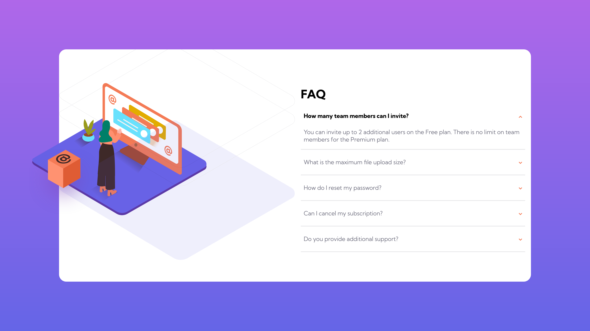
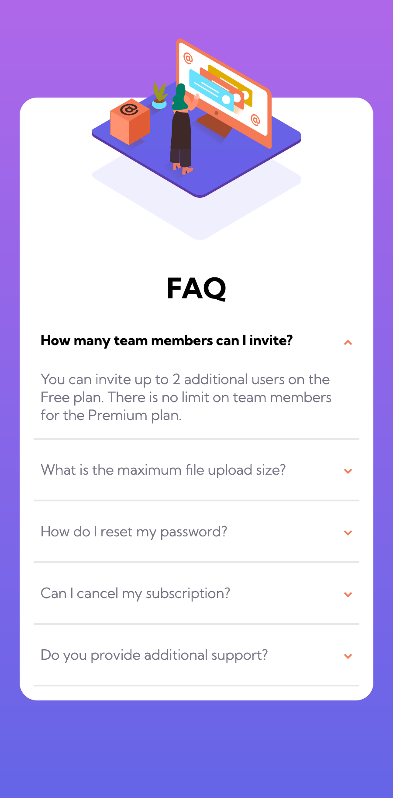

# Frontend Mentor - FAQ accordion card solution

This is a solution to the [FAQ accordion card challenge on Frontend Mentor](https://www.frontendmentor.io/challenges/faq-accordion-card-XlyjD0Oam). Frontend Mentor challenges help you improve your coding skills by building realistic projects.

## Table of contents

- [Overview](#overview)
  - [The challenge](#the-challenge)
  - [Screenshot](#screenshot)
  - [Links](#links)
- [My process](#my-process)
  - [Built with](#built-with)
  - [What I learned](#what-i-learned)
  - [Continued development](#continued-development)
- [Author](#author)
- [Acknowledgments](#acknowledgments)

## Overview

### The challenge

Users should be able to:

- View the optimal layout for the component depending on their device's screen size
- See hover states for all interactive elements on the page
- Hide/Show the answer to a question when the question is clicked

### Screenshot




### Links

- Solution URL: [Github](https://github.com/LySabrina/FAQ-Accordion)
- Live Site URL: [Live URL](https://lysabrina.github.io/FAQ-Accordion/)

## My process

### Built with

- Semantic HTML5 markup
- CSS custom properties
- Flexbox
- Mobile-first workflow

### What I learned

I had trouble working with CSS position property. It was difficult in getting the image to the right position. As the window change, the position of the image may shift to the wrong spot.

I tried tackling the problem by using flexbox to position the image in the center correctly.

```css
.hero-container {
  height: 10em;
  display: flex;
  justify-content: center;
  flex-direction: column;
  align-items: center;
}

.faq-hero {
  position: relative;
  width: 15em;
}

.faq-hero-pattern {
  position: relative;
  transform: translate(0px, -60px);
}
```

As seen above, I used flexbox and transform to position the pattern in a more specific manner. Position absolute allows me to use the top and right attributes.

```js
const questions = document.getElementsByClassName("question");
for (let i = 0; i < questions.length; i++) {
  questions[i].addEventListener("click", () => {
    questions[i].classList.toggle("question-open");
    const arrow = questions[i].querySelector("img");
    arrow.classList.toggle("flip");

    const answer = questions[i].nextElementSibling;
    answer.classList.toggle("open");
  });
}
```

From above, is JS code. I loop through each question and add an eventListener. When clicked, it will toggle the class hence it's like an on/off.

### Continued development

I need to continue learning about flexbox and position - specifically position. Since this project heavily uses position, I will need to better understand it.

Additionally, I will need to learn about animation and transform. These can help better the project.

## Author

- Frontend Mentor - [@lysabrina](https://www.frontendmentor.io/profile/LySabrina)
- GitHub - [@lysabrina](https://github.com/LySabrina)

## Acknowledgments
Thanks to FrontEndMentor for these projects. And me!.
